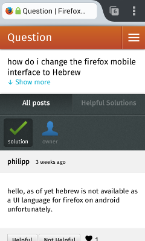
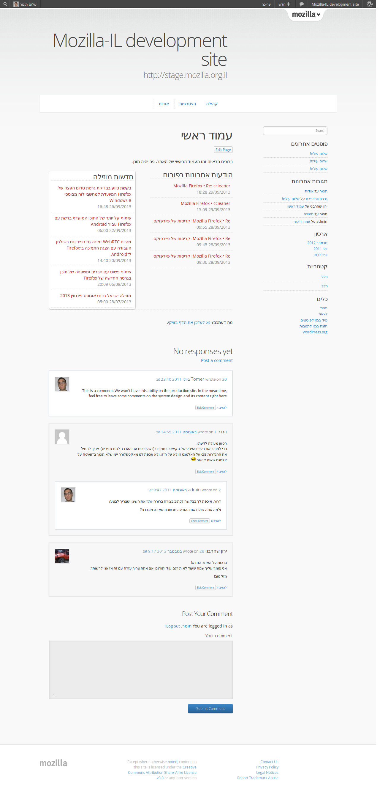

---

layout: default 

style: |

    #Cover h2 {
        margin:30px 0 0;
        color:#FFF;
        text-align:center;
        font-size:70px;
        }
    #Cover p {
        margin:10px 0 0;
        text-align:center;
        color:#FFF;
        font-style:italic;
        font-size:20px;
        }
        #Cover p a {
            color:#FFF;
            }
    #Picture h2 {
        color:#FFF;
        }
    #SeeMore h2 {
        font-size:100px
        }
    #SeeMore img {
        width:0.72em;
        height:0.72em;
        }
        
        
        
    .slide, html { background: url(themes/mozilla/images/bg-sandstone-2.png) }
    
    .slide, .full { background: none; }
    
    .slide img {max-width: 100%; max-height: 100%}
    .slide.cover img {width: 100%; height: 100%}
    
    .slide > div { padding: 25px 96px 0px 128px; } /* Start heading upper than default */
    
    .slide.cover { background: none } /* Remove black background */
    
    .shout a { color: rgba(255,255,255,0.5); text-decoration: none;}
    .slide.shout { background: none; }
---

# Mozilla in Israel  
{:#Cover data-timing="00:10"}

*Mozilla Summit 2013 World Expo*

{:.cover}

## Welcome to Israel 
{: data-timing="00:10"}

Founded in 1948
Population: 8,012,000 (2013 estimate)

## Satellite view
{: data-timing="00:10"}

{: style="height:100%; float: right;" }

Israel is a pretty small country lies to the shores of the Mediterranean sea, Right in the middle of middle east.

## Tower of David
{: data-timing="00:10"}

## Jerusalem Chord Bridge
{: data-timing="00:10"}

## Rothschild Boulevard in the heart of Tel Aviv
{: data-timing="00:10"}

{: style="height:100%" }

## Bahai Gardens in Haifa
{: data-timing="00:10"}

## View of Haifa industrial area
{: data-timing="00:10"}

## Sea of Galilee (lake Kinneret)
{: data-timing="00:10"}

## Masada in the Judean desert 
{: data-timing="00:10"}

## Mozilla Hummus!
{: data-timing="00:10"} 
cc-by-sa [@aharoni](https://twitter.com/aharoni) on Twitter ☺

{: style="height:70%"}

## Mozilla in Israel 
{: data-timing="00:10"}

* 11 [registered mozillians](https://mozillians.org/country/il/)
* 3 [registered Mozilla Reps](https://reps.mozilla.org/people/#/country/israel/)
* Three [domains](#mozillaisraelonline), Three social networking [profiles](#social)

## Core team members 
{: data-timing="00:10" #team1}

| Name         | Position                                                | Current location
|:------------:|:-------------------------------------------------------:|:-----------------------------------:|
| [Amiad]      | Translation, support & RTL bugs hunter                  | Stayed at home; available on [IRC]
| [Amir]       | [Rep mentor][ar], i18n expert                           | @Mozilla Summit Santa-Clara 
| [Elad]       | [Rep][er], team's go-to guy for gnome and Fedora things | @Mozilla Summit Toronto

## Core team members 
{: data-timing="00:10" #team2}

| Name         | Position                                                | Current location
|:------------:|:-------------------------------------------------------:|:-----------------------------------:|
| [Simon]      | Mozilla employee                                        | @Mozilla Summit Brussels
| [Tomer]      | Team lead, [ReMo][tr]                                   | @Mozilla Summit Toronto
| [Yaron]      | Translator and Activist                                 | @Mozilla Summit Toronto
|==============|=========================================================|====================================
| Could be you 

[Tomer]: https://mozillians.org/u/tomer/
[Yaron]: https://mozillians.org/u/sh.yaron/
[Elad]: https://mozillians.org/u/elad/
[Amiad]: https://mozillians.org/u/hatul/
[Amir]: https://mozillians.org/u/aharoni/
[Simon]: https://mozillians.org/u/smontagu/

[IRC]: irc://irc.mozilla.org/mozilla.il

[tr]: http://reps.mozilla.org/u/tomer/
[er]: http://reps.mozilla.org/u/elad/
[ar]: http://reps.mozilla.org/u/aharoni/

## Localization 
{: data-timing="00:10" #l10n}

* We've used Narro for some time.
* Now evaluating the service offered by Transifex.
* Other locales are welcome to join us.

## Mozilla Firefox
{: data-timing="00:10" #firefox}

* Hebrew locale lose 30% of its userbase in the last two years. 
* English locale won 40% of its userbase at the same time. (Data: MozMetrics/Block list)
* Is it because users prefer the en-US locale, or novice users switching to Google Chrome?

## Mozilla Firefox
{: data-timing="00:10" #firefox-2}

(Source: StatCounter)

## Mozilla Firefox for Android 
{: data-timing="00:10" #firefox-android}

* Has some issues that affect local users, including —
   * Problems with selecting text on page
   * Sites that doesn't provide good mobile web experience and suggest users to use their native application
* Number of users with the Hebrew locale: Zero – The Hebrew locale is not enabled, although we have translated it and commited files to Mercurial in the past.

## Mozilla Firefox for Android 
{: data-timing="00:10" #firefox-android-2}

## Firefox OS 
{: data-timing="00:10" #fxos}

* Barely used in Israel although some fanatics owns FirefoxOS devices, and there is geeks interested in buying such devices.
* Mozilla Israel members has few Keon devices. We use them to demo Firefox OS in various events. We are considering planning a Firefox OS hackathon.

## Mozilla Israel in local events 
{: data-timing="00:10" #events}

* [August Penguin 2013](#ap2013) 
* [HTML5Fest](#html5fest) 2012
* IN'13 
* Icon/Olamot

## August Penguin 
{: data-timing="00:10" #ap2013}

* [August Penguin][ap] is an annual multi-track users and developers conference dedicated to the local Open Source/Free Software community.
* We demonstrated during the conference the advantages of Firefox for Android and Firefox OS, and held some talks with developers about the advantages of the web over regular mobile applications. 
* Mozilla Reps take part in all sorts of open source activity and most of them are well known among the Israeli community.

## August Penguin 
{: data-timing="00:10" #ap2013-2}

* The photo below was taken when the stand was not crowded, otherwise the stand was simply hidden behind all the crowd.

[ap]: https://reps.mozilla.org/e/august-penguin-2013/

## HTML5Fest 2012
{: data-timing="00:10" #html5fest}

* HTML5Fest is a full day multi-track developers conference about web technologies, organized by the Israeli w3c office.
* We were lucky enough [to participate] and talk about the open web during the conference. 
* We also demonstrated Firefox OS on virtual machines to developers.

[to participate]: https://reps.mozilla.org/e/html5fest-2012/

## HTML5Fest 2012
{:.cover}
{: data-timing="00:10" #html5fest-2}

## Mozilla Israel online 
{: data-timing="00:10" #online}

We are running three domains and two websites –

* [mozilla.org.il](#mozillaorgil)
* [firefox.co.il](#firefoxcoil) / firefox.org.il
* In addition, we have localized [mozilla.org](#mozillaorghe)…

## firefox.co.il 
{: data-timing="00:10"}

{: style="width: 66%; float: right; "}

* [firefox.co.il](http://firefox.co.il)
A domain that was donated to us. Acts as a landing page and doesn't have its own content besides mozilla.org with some localized links on top
* [firefox.org.il](http://firefox.org.il)
A domain that was donated to us. Links to mozilla.org. We don't really have an idea what to place there…

## mozilla.org.il 
{: data-timing="00:10"}

Our main site. Has a news section (based on WordPress) and an active support forum (phpBB).

{: style="width: 66%"}

## mozilla.org.il (on-going development site)
{: data-timing="00:10"}
The site has a few static pages which are outdated for few years now, but we placed a script that update version information and download links based on the products version API from mozilla.org.

We want to convert the site to the new design at some point in the future and update some of the site content.

## mozilla.org.il (on-going development site)
{: data-timing="00:10"}

{: style="width: 45%; float: left" }

{: style="width: 45%; float: left" }

## mozilla.org/he/
{: data-timing="00:10"}

Work started. Expected to be awesome!

{: style="width: 66%"}

## Social presence 
{: #social data-timing="00:10"}

   * [Facebook]     (MozillaIsrael) (1600+ likes)
   * [Twitter]      (@MozillaIsrael) (200+ followers)
   * [Google Plus]  (+MozillaIsrael) (70 members)

[Facebook]:https://facebook.com/MozillaIsrael
[Twitter]:https://twitter.com/MozillaIsrael
[Google Plus]:https://plus.google.com/+MozillaIsrael

Google Plus is mostly abandoned because it requires manual updating. 

Twitter and Facebook aggregate new posts from our site, as well as forum threads that receive after they pass a specified replies threshold using a custom script.

## ‎‎‎[⇦ Back to start](#Cover)
{:.shout #final}
